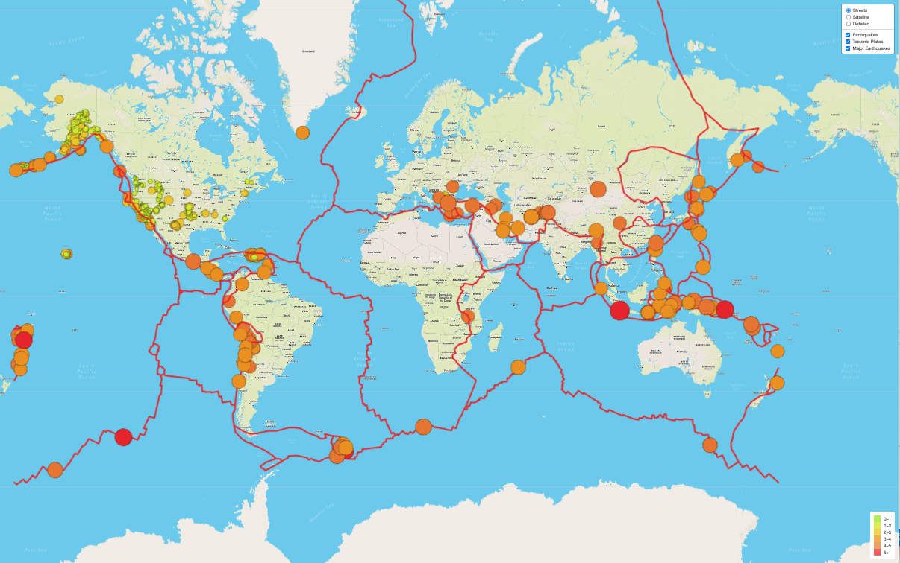

# Mapping Earthquakes

## Overview

This project was created to develop an interactive webpage that displays earthquake data from the USGS website from the past 7 days.  The information is presented using the JavaScript module Leaflet with map styles from Mapbox.  The data is collected from USGS and highlights the location and magnitude of the events.  In addition, the location of the tectonic plates are an added layer to the map as lines along their location.

---

## Results

The map was created to have multiple map styles and layers that users can select to customize their view of the data available on the webpage.  Each element of the data being visualized are layers that can be toggled on and off by the user.  The map views include street, satellite and navigation pages that can be selected as the base map layer where the earthquake data is projected onto.  The earthquake data contains the complete list of events from the past 7 days as well as the events with a magnitude greater than 4.5 as major earthquakes.  The tectonic plate date was collected as a JSON from a [GitHub repository](https://github.com/fraxen/tectonicplates) that contains the coordinates of the lines that divide the plates. Using the webpage requires an API KEY from [MapBox](https://www.mapbox.com) to be placed in a config.js file in the js folder.

View of the webpage view

---

## Summary

The use of interactive webpages to display data provides a more meaningful way to present data that allows the user to view multiple points of information in one place.  In this case we have the location and magnitude of the earthquake events visualized graphically using color and size to show the magnitude of the event and the location accurately placed as a layer on the map to provide a visual representation of the events.  Quickly a user can locate regions of high density of events and the magnitude with ease.  With the added layer of the location of the tectonic fault lines, it is easy to see the correlation between the events and the relationship with these geological features. 

---
